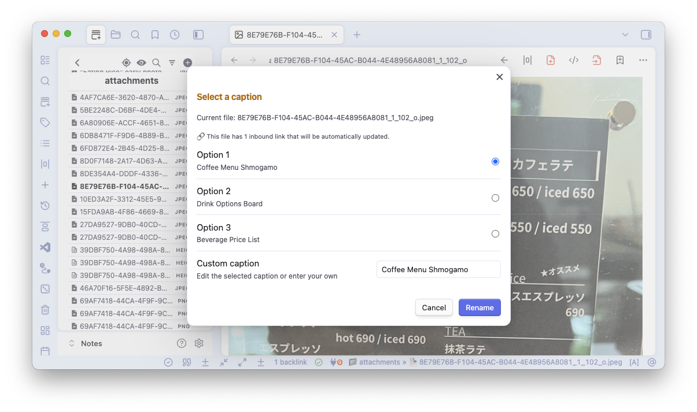

# Obsidian Image Renamer

An Obsidian plugin that uses AI vision models to automatically generate meaningful names for image files.

I end up with a lot of files in my attachments folder with names like `8E79E76B-F104-45AC-B044-4E48956A8081_1_102_o.jpeg`. This plugin uses an AI vision model to rename them with meaningful names.

## Usage

### Commands

The plugin adds two commands to Obsidian:

1. **Rename with best suggestion**: Automatically renames the current image file with the first AI-generated suggestion
2. **Rename from suggestions**: Shows a modal with multiple caption suggestions that you can choose from or edit

### How to Use

1. **From File Explorer**: Right-click any image file and select "Rename with best suggestion" or "Rename from suggestions"
2. **From Inline Images**: Right-click on an image displayed inline in a note and select the rename options
3. **From Open File**: Open an image file and run commands from the Command Palette (Ctrl/Cmd + P)
4. The plugin will:
   - Send the image to your configured AI service
   - Generate caption suggestions
   - Either rename automatically or show you options to choose from
   - Update all links to the image throughout your vault

## Features

- **AI-Powered Captions**: Uses vision models (like GPT-4 Vision) to analyze images and generate descriptive filenames
- **Interactive Mode**: Choose from multiple AI-generated suggestions or create your own custom name
- **Automatic Mode**: Quickly rename files with the best AI-generated caption
- **Smart Renaming**: Uses the Obsidian rename function, so that all references to the renamed file are updated throughout the vault
- **Customizable Formatting**:
  - Date prefixes (YYYY-MM-DD format)
  - Case styles (lowercase, UPPERCASE, Title Case, Sentence case)
  - Space handling (spaces or hyphens)

## Installation

### Manual Installation

1. Download the latest release from the GitHub releases page
2. Extract the files to your vault's `.obsidian/plugins/obsidian-image-renamer` folder
3. Reload Obsidian
4. Enable the plugin in Settings → Community plugins

### Using BRAT (Beta Reviewers Auto-update Tool)

1. Install and enable the BRAT plugin from Obsidian's Community Plugins
2. In BRAT settings, click "Add Beta plugin"
3. Enter this repository URL: `https://github.com/osteele/obsidian-image-renamer`
4. Click "Add Plugin"
5. Enable "Obsidian Image Renamer" in Settings → Community plugins

## Configuration

Configure the plugin in Settings → Plugin Options → Image Renamer:

- **API Key**: Your OpenAI API key (or compatible service)
- **API Endpoint**: The API endpoint for the vision model (defaults to OpenAI)
- **Model**: The model to use (e.g., `gpt-4o-mini`)
- **Date Prefix**: Add creation date to filenames (YYYY-MM-DD format)
- **Case Style**: How to format the filename text
- **Allow Spaces**: Use spaces in filenames (otherwise converts to hyphens)

## API Services

The plugin is designed to work with OpenAI's vision models but can be configured to work with any compatible API endpoint that accepts the same request format.

### OpenAI Setup

1. Get an API key from [OpenAI](https://platform.openai.com/api-keys)
2. Enter the key in the plugin settings
3. Use model `gpt-4o-mini` for best results

### Alternative Services

You can use any service that provides an OpenAI-compatible API by changing the API Endpoint in settings.

### Local Models (Privacy-First)

You can run vision models locally on your computer for complete privacy. See [LOCAL_MODELS.md](docs/LOCAL_MODELS.md) for detailed setup instructions. Popular options:
- **Ollama** with LLaVA or Llama 3.2 Vision
- **LM Studio** with various vision models
- **LocalAI** for advanced users

## Development

See [DEVELOPMENT.md](DEVELOPMENT.md) for build instructions and development guidelines.

## Roadmap

- [x] Support for local AI models
- [ ] Support for Anthropic and Gemini
- [ ] Batch rename all files with generic names (e.g. `download`,`image`, `sreenshot`, or UUIDs)
- [ ] Custom prompt templates for different types of images
- [ ] Automatic retry with new API call when generated name already exists in vault

## Related Projects

### My Command-Line Tools
- [rename-image-files](https://github.com/osteele/rename-image-files) - CLI tool to batch rename image files using AI-generated captions. This extension was adapted from that one.
- [rename-academic-pdf](https://github.com/osteele/rename-academic-pdf) - CLI tool to rename academic PDFs based on their content and metadata

### Related Obsidian Plugins
You might find these plugins useful as well:
- [Attachment Management](https://github.com/trganda/obsidian-attachment-management) - Comprehensive attachment organization and management
- [Attachment Organizer](https://github.com/DudeThatsErin/attachment-organizer) - Automatically organize attachments with flexible naming rules
- [Paste Image Rename](https://github.com/reorx/obsidian-paste-image-rename) - Rename images automatically when pasting into Obsidian

**For bulk renaming:** This plugin does not currently support bulk renaming. As an alternative approach to renaming multiple files, you can use my CLI tool [rename-image-files](https://github.com/osteele/rename-image-files) in conjunction with [External Rename Handler](https://github.com/mnaoumov/obsidian-external-rename-handler) to batch rename images while preserving Obsidian links. Use the `--dry-run` mode option first!

## License

MIT

## Author

Oliver Steele
